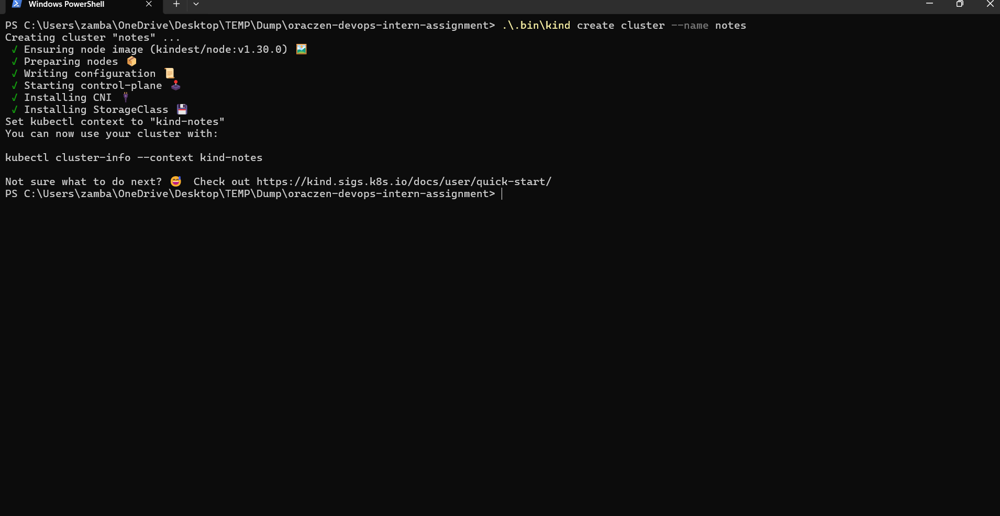
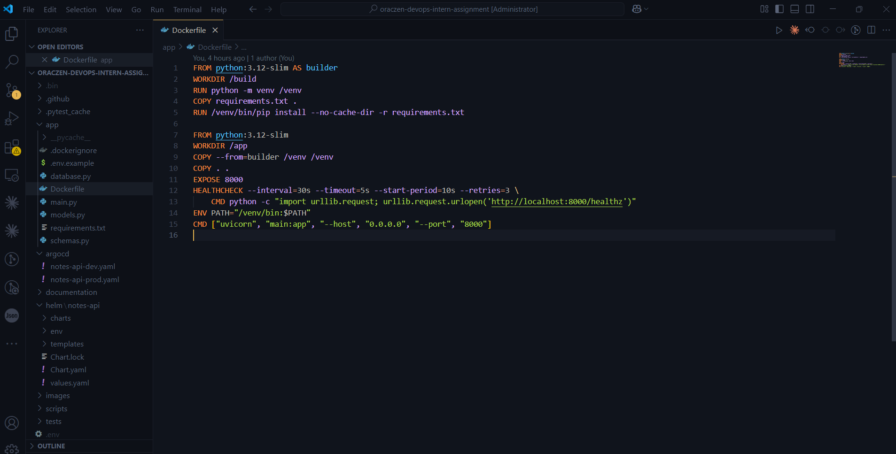
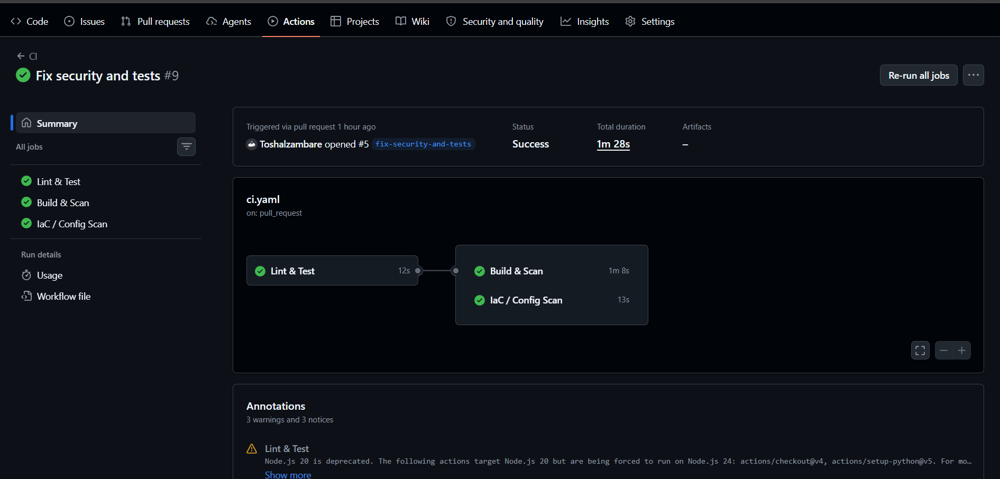
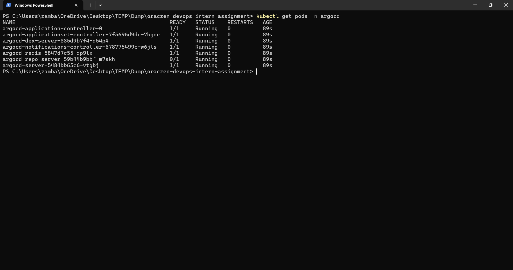
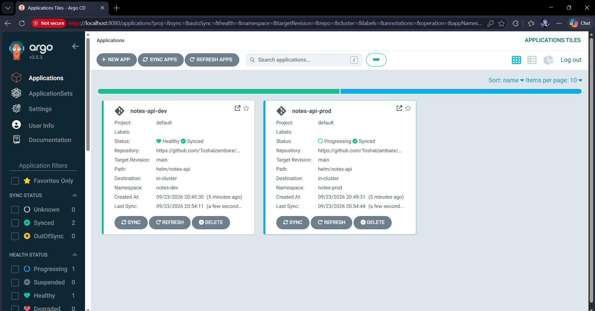
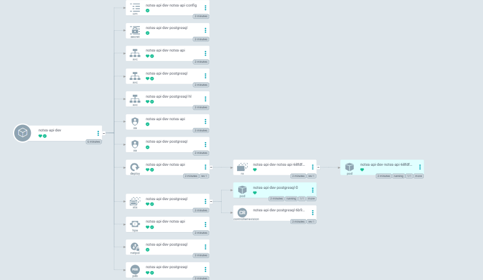
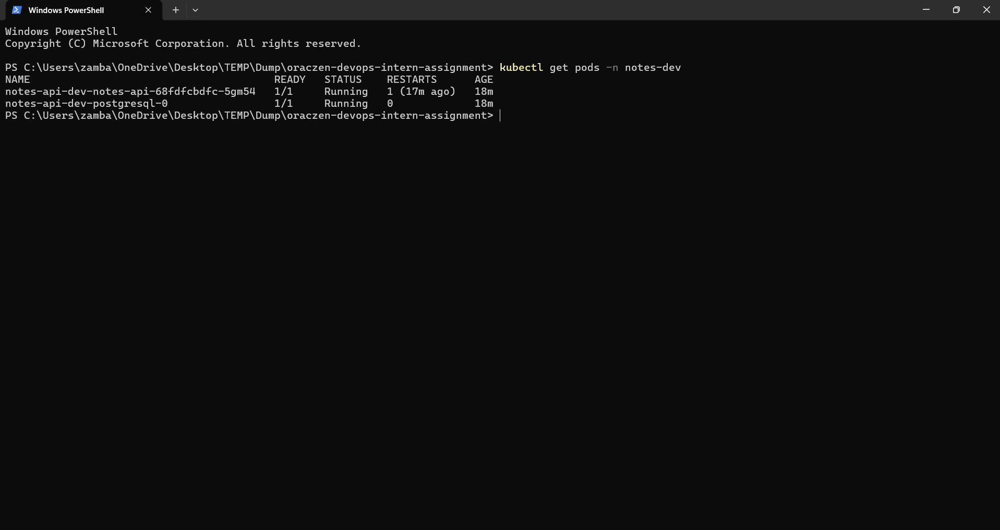
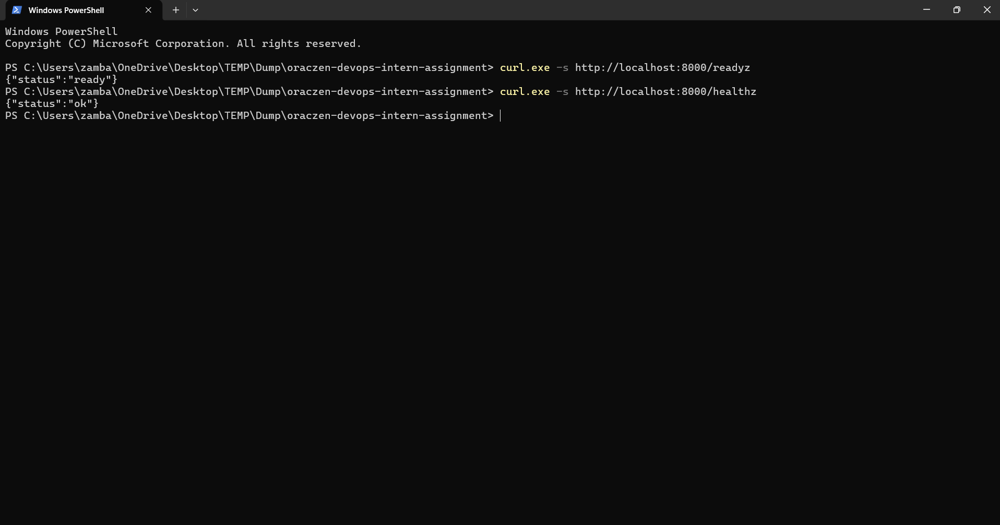
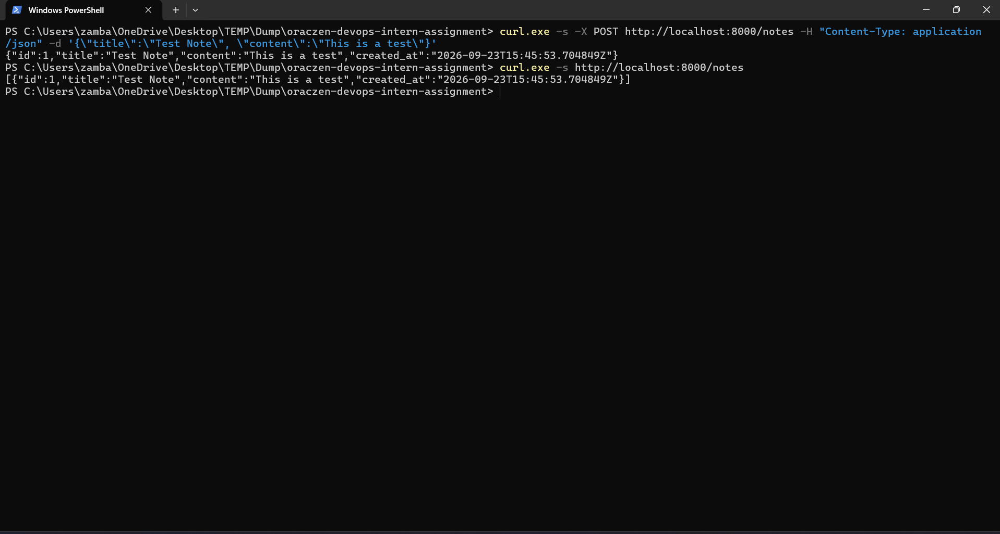
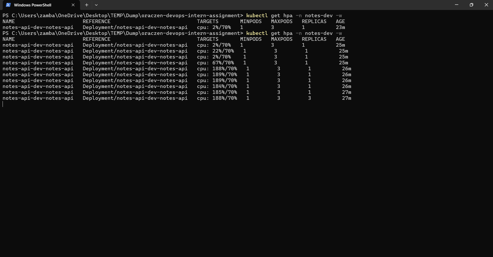

# DevOps Internship Assignment Write-up

**Candidate Name:** Toshal Zambare  
**Portfolio:** www.toshal.space  
**Repository:** https://github.com/Toshalzambare/Oraczen_devops

---

## Technologies Used
- **Docker**: Containerization using multi-stage builds for a minimal attack surface.
- **Kubernetes (kind)**: Local cluster environment to simulate EKS.
- **Helm**: Package management and deployment templating.
- **PostgreSQL**: Stateful database managed via Helm dependency.
- **GitHub Actions**: CI pipeline for testing, building, and security scanning.
- **ArgoCD**: GitOps continuous delivery for declarative deployments.
- **HPA**: Horizontal Pod Autoscaling based on CPU utilization.
- **Trivy**: Security scanning for container images and IaC misconfigurations.
- **Pytest**: Unit testing framework for the FastAPI backend.
- **FastAPI**: Backend application framework.

---

## Quick Start / Setup Environment (Sequential Execution)

The following `.sh` commands will completely set up the project on a local machine, assuming you have cloned the repository and have Docker and Helm installed.



```bash
#!/bin/bash
set -e

# 1. Create the kind cluster
./.bin/kind create cluster --name notes

# 2. Install metrics-server for HPA support (patched for kind TLS)
kubectl apply -f https://github.com/kubernetes-sigs/metrics-server/releases/latest/download/components.yaml
kubectl patch deployment metrics-server -n kube-system --type='json' -p='[{"op": "add", "path": "/spec/template/spec/containers/0/args/-", "value": "--kubelet-insecure-tls"}]'

# 3. Build and load the Docker image
docker build -t notes-api:local -f app/Dockerfile app/
./.bin/kind load docker-image notes-api:local --name notes

# 4. Fetch Helm dependencies (PostgreSQL subchart)
./.bin/helm dependency build helm/notes-api

# 5. Install the Helm chart (Dev environment)
./.bin/helm install notes-api helm/notes-api -f helm/notes-api/env/dev/values.yaml \
  --namespace notes-dev --create-namespace

# 6. Wait for the pods to become ready (PostgreSQL takes a minute)
kubectl get pods -n notes-dev -w

# 7. Port-forward the API service to localhost (Run in a separate terminal)
kubectl port-forward svc/notes-api-notes-api 8000:8000 -n notes-dev

# 8. Test the endpoints
curl.exe -s http://localhost:8000/readyz
curl.exe -s -X POST http://localhost:8000/notes -H "Content-Type: application/json" -d '{\"title\":\"secure notes\", \"content\":\"working securely\"}'
curl.exe -s http://localhost:8000/notes

# 9. Test HPA scaling (Run in a separate terminal)
chmod +x scripts/load_test.sh
./scripts/load_test.sh http://localhost:8000 120

# 10. Watch HPA scale up
kubectl get hpa -n notes-dev -w
```

---

## Part 1 — Containerize the app

### What We Did
I containerized the FastAPI application using a multi-stage `Dockerfile` and configured a `.dockerignore` file to keep the build context small.



### How We Did It
The `Dockerfile` consists of two stages:
1. **Builder Stage:** Uses `python:3.12-slim` to install dependencies via `pip` into a virtual environment (`/venv`).
2. **Runtime Stage:** Starts fresh from `python:3.12-slim`, copies only the `/venv` and the application code. It exposes port 8000 and defines a `HEALTHCHECK` instruction. The container naturally runs securely without needing root access.

### Commands Used
```bash
docker build -t notes-api:local -f app/Dockerfile app/
docker run --rm -p 8000:8000 \
  -e POSTGRES_HOST=host.docker.internal \
  -e POSTGRES_PASSWORD=notes \
  notes-api:local
```

### Assignment Questions

**Q: Explain why you'd rely on Kubernetes probes instead of the Docker HEALTHCHECK instruction.**  
**Answer:** While I included a Docker `HEALTHCHECK` for standalone local testing, Kubernetes native liveness and readiness probes are far superior in a cluster environment. Kubernetes probes dictate whether a pod receives traffic (Readiness) and when a pod should be aggressively restarted (Liveness). Docker's built-in health check is largely ignored by Kubernetes because kubelet manages container lifecycles directly via its own probe mechanisms.

### Trade-offs / What I'd Do Differently With More Time
With more time, I would switch the runtime stage base image to a "Distroless" Python image or create a dedicated non-root user (`useradd -m appuser`) directly in the Dockerfile. Distroless images contain only the application runtime and dependencies—no shell or package manager—dramatically reducing the attack surface.

---

## Part 2 — Helm chart with a database dependency

### What We Did
I wrote a complete Helm chart at `helm/notes-api/` that deploys the application alongside a PostgreSQL database dependency, with clean environment overrides for Dev and Prod.

### How We Did It
1. **App Templates:** Created a `Deployment`, `Service`, `ConfigMap`, `ServiceAccount`, and `HPA`. To ensure security (based on Trivy IaC scans), I added a strict `securityContext` to the Deployment (read-only root filesystem, run as non-root user 1000, drop all capabilities).
2. **Database Dependency:** Added the Bitnami PostgreSQL chart to `Chart.yaml` dependencies.
3. **Secret Wiring:** The application securely retrieves the database password generated by the Bitnami subchart using a `secretKeyRef` in the Deployment environment variables (`POSTGRES_PASSWORD`), ensuring no plain-text passwords exist in the repository.
4. **Overrides:** Split values cleanly into `env/dev/values.yaml` and `env/prod/values.yaml` with differing replica counts, resource requests/limits, and database persistence settings.

### Commands Used
```bash
./.bin/helm dependency build helm/notes-api
./.bin/helm install notes-dev helm/notes-api -f helm/notes-api/env/dev/values.yaml --namespace notes-dev --create-namespace
./.bin/helm lint helm/notes-api
./.bin/helm template notes-ci helm/notes-api -f helm/notes-api/env/dev/values.yaml
```

### Assignment Questions

**Q: Do you understand how to reference a dependency's generated Secret instead of duplicating the value?**  
**Answer:** Yes. In the `deployment.yaml`, the `POSTGRES_PASSWORD` environment variable uses `valueFrom.secretKeyRef`. The `name` points to the dynamically generated Bitnami PostgreSQL secret (e.g., `{{ .Release.Name }}-postgresql`), and the `key` is `password`. This securely injects the password into the pod at runtime without exposing it in values.yaml.

### Trade-offs / What I'd Do Differently With More Time
I would add a `NetworkPolicy` restricting inbound traffic to the PostgreSQL pod so only API pods can connect to port 5432. For production, I would also add a `PodDisruptionBudget` to ensure high availability during node maintenance.

---

## Part 3 — CI pipeline (GitHub Actions)

### What We Did
I built a GitHub Actions CI pipeline (`.github/workflows/ci.yaml`) that automatically tests, builds, and securely scans the application on every pull request to `main`.



### How We Did It
1. **Python Checks:** Installs dependencies and runs `pytest`. (Note: I had to refactor the broken test suite to use an in-memory SQLite database to natively support SQLAlchemy 2.0 type checks).
2. **Build Image:** Builds the Docker image and tags it with the Git SHA.
3. **Trivy Image Scan:** Scans the built image for HIGH/CRITICAL vulnerabilities. I explicitly updated `app/requirements.txt` to unpin FastAPI, allowing `pip` to automatically resolve and install the latest secure version of Starlette (`>=1.3.1`) to resolve all CVEs.
4. **IaC Scan:** Renders the Helm templates and scans them with Trivy to catch misconfigurations (which I fixed by adding the `securityContext`).

### Commands Used (Local Verification)
```bash
pytest tests/ -v
docker build -t notes-api:local app/
trivy image --severity HIGH,CRITICAL --ignore-unfixed notes-api:local
./.bin/helm template notes-ci helm/notes-api > /tmp/rendered.yaml
trivy config --severity HIGH,CRITICAL /tmp/rendered.yaml
```

### Assignment Questions

**Q: Explain why you chose the severity gate for Trivy.**  
**Answer:** I set the severity gate to fail the pipeline only on `HIGH,CRITICAL` vulnerabilities with the `ignore-unfixed: true` flag. This is an optimal choice for a modern CI/CD pipeline because it prevents deployments containing severe, exploitable, and fixable CVEs while avoiding pipeline fatigue caused by low-severity or un-patchable vulnerabilities that developers cannot act upon.

### Trade-offs / What I'd Do Differently With More Time
I would push the Docker image to a registry like GitHub Container Registry (`ghcr.io`) upon a successful merge to `main`. Furthermore, I would implement Docker layer caching and `pip` caching in the workflow to drastically reduce CI execution time.

---

## Part 4 — GitOps with ArgoCD

### What We Did
I wrote declarative ArgoCD `Application` manifests (`argocd/notes-api-dev.yaml` and `argocd/notes-api-prod.yaml`) to continuously deliver the Helm chart.

### How We Did It
The manifests point to the Helm chart in the Git repository and define the specific `values.yaml` file to use for each environment. They target their respective namespaces (`notes-dev` and `notes-prod`).



### Commands Used
```bash
kubectl create namespace argocd
kubectl apply --server-side -n argocd -f https://raw.githubusercontent.com/argoproj/argo-cd/stable/manifests/install.yaml
kubectl apply -f argocd/notes-api-dev.yaml
kubectl apply -f argocd/notes-api-prod.yaml
```

### Verification (ArgoCD & Pod Health)

- `notes-api-dev` Synced and Healthy in ArgoCD UI:
  

- Full Kubernetes resource tree (Deployment, Service, ConfigMap, Bitnami PostgreSQL subchart):
  

- All pods `1/1 Running`:
  

- Readiness probe (`/readyz`) HTTP 200 with database connected:
  

- Full CRUD testing (`POST /notes`, `GET /notes`) verifying data persistence:
  


### Assignment Questions

**Q: Decide whether `automated: {prune: true, selfHeal: true}` is appropriate for prod vs dev, and explain your choice.**  
**Answer:**  
For **Dev**, `automated: {prune: true, selfHeal: true}` is highly appropriate. It ensures that the cluster immediately reflects Git changes without manual intervention, enabling a fast feedback loop for developers.  
For **Prod**, this setting is extremely dangerous. Production should use manual syncs or highly gated automated syncs. `prune: true` could accidentally delete production databases if a resource is temporarily removed from Git. Thus, for Prod, syncs should be controlled and reviewed by an engineer before execution.

**Q: If someone edits `values-prod.yaml` and merges it to `main`, what's the sequence of events from that merge to the new pod running? Where would you look if it didn't roll out?**  
**Answer:**  
1. Code is merged to `main`.
2. ArgoCD periodically polls Git (or is triggered by a webhook) and detects the commit drift, marking the application as `OutOfSync`.
3. Since Prod requires manual syncing, an engineer logs into ArgoCD, reviews the diff, and clicks "Sync".
4. ArgoCD applies the updated Kubernetes manifests.
5. The Deployment controller scales up a new ReplicaSet and performs a rolling update to the new pods.

**If it doesn't roll out:** I would first check the ArgoCD dashboard for sync errors or degraded states. Next, I would run `kubectl get pods -n notes-prod`, followed by `kubectl describe pod <failing-pod>` to check events (e.g., ImagePullBackOff, probe failures), and `kubectl logs <failing-pod>` to check application crashes.

### Trade-offs / What I'd Do Differently With More Time
I would configure a GitHub webhook to trigger ArgoCD syncs instantly instead of relying on the default 3-minute polling interval. I would also use ArgoCD RBAC to strictly enforce that only Senior Engineers can trigger a production sync.

---

## Part 5 — Stretch (Optional)

### 1. Autoscaling under load
**What We Did:** Implemented a HorizontalPodAutoscaler (HPA) in the Helm chart targeting 70% average CPU utilization.  
**How We Did It:** Created `hpa.yaml` in the Helm templates, gated by `.Values.autoscaling.enabled`. I ran `./scripts/load_test.sh` to blast the API with requests, and verified via `kubectl get hpa -w` that the replicas dynamically scaled up to handle the load.



### 2. Monitoring hooks
**What We Did:** Configured Prometheus scrape annotations (`prometheus.io/scrape: "true"`) in the pod templates.  
**Trade-offs:** Relying on annotations is the legacy approach. A modern Prometheus Operator stack uses `ServiceMonitor` Custom Resource Definitions (CRDs) which are far more robust and declarative.  
**Optimal Alerts:** If I had Prometheus Alertmanager set up, I would define alerts for:
1. **High Error Rate:** HTTP 5xx responses > 5% over 5 minutes.
2. **Readiness Flapping:** Pod readiness failing repeatedly, indicating a database connection issue.
3. **High Latency:** p95 response time exceeding 500ms.

### 3. Secrets management proposal
**Proposal:** External Secrets Operator (ESO) backed by AWS Secrets Manager.  
Since the production stack runs on AWS EKS, ESO is the optimal choice. It allows us to keep `values-prod.yaml` in Git without any encrypted blobs (unlike SOPS or Sealed Secrets). The Helm chart would deploy an `ExternalSecret` custom resource instead of a standard `Secret`. ESO uses an IAM Role for Service Accounts (IRSA) to securely authenticate with AWS Secrets Manager, pull the real PostgreSQL password, and inject it dynamically into a native Kubernetes Secret. This keeps the Git repository 100% declarative and entirely free of cryptographic keys.
